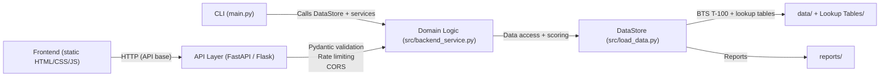

# Architecture Overview

- **Presentation**: Static frontend (`frontend/`) and a CLI entrypoint (`main.py`) call the API layer or domain logic directly.
- **API layer**: FastAPI (`src/api.py`) and Flask (`backend/app.py`) adapters add CORS, structured logging, rate limiting, request timing, and health checks.
- **Domain logic**: `src/backend_service.py` orchestrates validations, comparisons, CBSA simulations, and scoring/caching utilities.
- **Data access**: `src/load_data.py` loads the BTS T-100 segment export (`T_T100_SEGMENT_ALL_CARRIER.csv`), uses BTS lookup tables for carriers/airports, applies equipment/codeshare overrides, and exposes scoring helpers.
- **Ops**: Dockerfile + docker-compose power local/prod parity; CI runs lint + pytest; scripts in `scripts/` handle reports, data conversion, ASM quality checks, and load testing.
