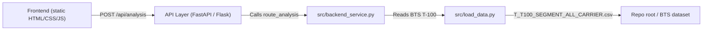

# Architecture Overview

- **Presentation**: The static frontend (served from `frontend/`) runs a tiny JS form that posts an airline query to `/api/analysis` and renders the returned route summary.
- **API layer**: FastAPI (`src/api.py`) and Flask (`backend/app.py`) adapters provide rate limiting, logging, and a single analysis endpoint plus airline search derived from the BTS lookup tables.
- **Domain logic**: `src/backend_service.py` now exposes `route_analysis` which builds a graph, summarizes top routes, and reports seats/distance metrics from the T-100 export.
- **Data access**: `src/load_data.py` ingest the BTS T-100 segment CSV (`T_T100_SEGMENT_ALL_CARRIER.csv`) and related lookup tables (`Lookup Tables/L_UNIQUE_CARRIERS.csv`, `Lookup Tables/L_AIRPORT.csv`) to enrich the routes with airport metadata.
